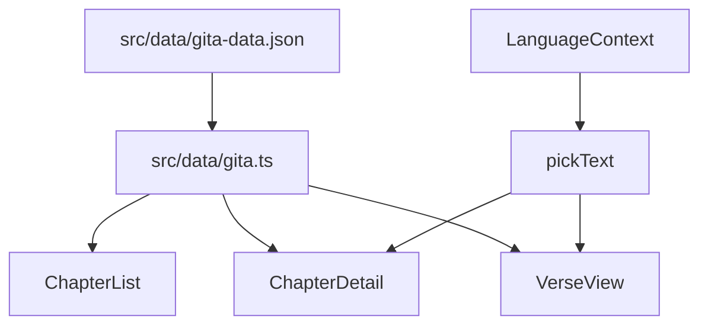
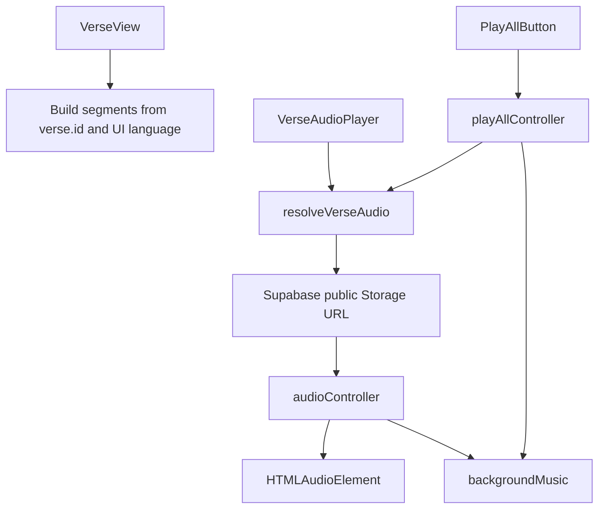

# Bhagavad Gita Content Audit - Data Map

Step 1 deliverable for `cursor-prompt-gita-audit.md`.

This file maps where the app stores and renders Bhagavad Gita text and audio. It does not verify correctness against canonical sources and does not change any content.

## Execution Notes

- Audit branch created: `audit/content-accuracy-20260516`.
- Baseline commit created before this audit artifact: `f8ef970` (`chore: add content accuracy audit prompt`).
- No ElevenLabs calls were made.
- No content fixes were made.

## Text Data Sources

| Content | Location | Notes |
| --- | --- | --- |
| Bhagavad Gita chapters, Sanskrit shlokas, transliteration, translations, explanations | `src/data/gita-data.json` | Primary content corpus loaded at build time. |
| TypeScript schema and text helpers | `src/data/gita.ts` | Defines `Chapter`, `Verse`, `LocalizedText`, `pickText`, and `getChapterName`. |
| App UI labels and navigation strings | `src/i18n/translations.ts` | UI copy only. Verse text does not come from this file. |
| Unused chapter label exports | `src/i18n/translations.ts` | `chapterNames` and `chapterSummaries` are exported but not referenced under `src/`. |

The primary dataset currently contains 18 chapters and 701 verse records. Chapter 13 contains 35 records, which is one of the edition-dependent counts noted in the audit prompt.

## Chapter Count Snapshot

| Chapter | `verseCount` | `verses.length` | First verse id | Last verse id |
| --- | ---: | ---: | ---: | ---: |
| 1 | 47 | 47 | 1 | 47 |
| 2 | 72 | 72 | 1 | 72 |
| 3 | 43 | 43 | 1 | 43 |
| 4 | 42 | 42 | 1 | 42 |
| 5 | 29 | 29 | 1 | 29 |
| 6 | 47 | 47 | 1 | 47 |
| 7 | 30 | 30 | 1 | 30 |
| 8 | 28 | 28 | 1 | 28 |
| 9 | 34 | 34 | 1 | 34 |
| 10 | 42 | 42 | 1 | 42 |
| 11 | 55 | 55 | 1 | 55 |
| 12 | 20 | 20 | 1 | 20 |
| 13 | 35 | 35 | 1 | 35 |
| 14 | 27 | 27 | 1 | 27 |
| 15 | 20 | 20 | 1 | 20 |
| 16 | 24 | 24 | 1 | 24 |
| 17 | 28 | 28 | 1 | 28 |
| 18 | 78 | 78 | 1 | 78 |

## Verse Schema

Defined in `src/data/gita.ts`:

```ts
interface LocalizedText {
  hi: string;
  bn: string;
  en: string;
}

interface Verse {
  id: number;
  sanskrit: string;
  transliteration: string;
  translation: LocalizedText;
  explanation: LocalizedText;
}

interface Chapter {
  id: number;
  verseCount: number;
  name: LocalizedText & { sanskrit: string };
  meaning: LocalizedText;
  summary: LocalizedText;
  verses: Verse[];
}
```

## Real Verse Record Example

From `src/data/gita-data.json`, chapter 1 verse 1:

```json
{
  "id": 1,
  "sanskrit": "धृतराष्ट्र उवाच\n\nधर्मक्षेत्रे कुरुक्षेत्रे समवेता युयुत्सवः।\n\nमामकाः पाण्डवाश्चैव किमकुर्वत सञ्जय।।1.1।।",
  "transliteration": "dhṛitarāśhtra uvācha\ndharma-kṣhetre kuru-kṣhetre samavetā yuyutsavaḥ\nmāmakāḥ pāṇḍavāśhchaiva kimakurvata sañjaya",
  "translation": {
    "hi": "धृतराष्ट्र ने कहा -- हे संजय ! धर्मभूमि कुरुक्षेत्र में एकत्र हुए युद्ध के इच्छुक (युयुत्सव:) मेरे और पाण्डु के पुत्रों ने क्या किया?",
    "en": "Dhritarashtra said, \"What did my people and the sons of Pandu do when they had assembled together, eager for battle, on the holy plain of Kurukshetra, O Sanjaya?",
    "bn": "ধৃতরাষ্ট্র বললেন: সঞ্জয়, ধর্মক্ষেত্র কুরুক্ষেত্রে যখন আমার পুত্রেরা ও পাণ্ডুর পুত্রেরা যুদ্ধ করার জন্য সমবেত হল, তখন তারা কী করল?"
  },
  "explanation": {
    "hi": "सम्पूर्ण गीता में यही एक मात्र श्लोक अन्ध वृद्ध राजा धृतराष्ट्र ने कहा है। शेष सभी श्लोक संजय के कहे हुए हैं जो धृतराष्ट्र को युद्ध के पूर्व की घटनाओं का वृत्तान्त सुना रहा था।\nनिश्चय ही अन्ध वृद्ध राजा धृतराष्ट्र को अपने भतीजे पाण्डवों के साथ किये गये घोर अन्याय का पूर्ण भान था। वह दोनों सेनाओं की तुलनात्मक शक्तियों से परिचित था। उसे अपने पुत्र की विशाल सेना की सार्मथ्य पर पूर्ण विश्वास था। यह सब कुछ होते हुये भी मन ही मन उसे अपने दुष्कर्मों के अपराध बोध से हृदय पर भार अनुभव हो रहा था और युद्ध के अन्तिम परिणाम के सम्बन्ध में भी उसे संदेह था। कुरुक्षेत्र में क्या हुआ इसके विषय में वह संजय से प्रश्न पूछता है। महर्षि वेदव्यास जी ने संजय को ऐसी दिव्य दृष्टि प्रदान की थी जिसके द्वारा वह सम्पूर्ण युद्धभूमि में हो रही घटनाओं को देख और सुन सकता था।",
    "en": "The blind king Dhritarashtra asks his minister Sanjaya what is happening on the battlefield. He wants to know what his sons and the sons of Pandu did when they gathered there to fight. This opening question sets the stage for the entire conversation that follows.",
    "bn": "দৃষ্টিহীন রাজা ধৃতরাষ্ট্র তাঁর মন্ত্রী সঞ্জয়কে জিজ্ঞাসা করছেন যে যুদ্ধক্ষেত্রে কী ঘটছে। তিনি জানতে চান যে তাঁর পুত্ররা এবং পাণ্ডুর পুত্ররা সেখানে যুদ্ধ করার জন্য একত্রিত হয়ে কী করল। এই প্রশ্নটির মাধ্যমেই সমগ্র কথোপকথনের সূচনা হয়।"
  }
}
```

## Text Rendering Flow



Important rendering details:

- `src/data/gita.ts` imports the JSON as `rawData` and exports `chapters`.
- `pickText(text, lang)` chooses `text[lang]`, then falls back to `en`, `hi`, `bn`, or `""`.
- English explanations pass through `cleanEnglishCommentary()`, which removes source glossary text before the literal marker `Commentary`. If no marker exists and the string looks like a word gloss, it returns an empty string.
- `getChapterName(chapter, lang)` uses `chapter.name[lang]`, then falls back to `chapter.name.sanskrit` or `chapter.name.en`.

## Verse Identity And Off-By-One Risk Points

| Area | Behavior | Risk |
| --- | --- | --- |
| `ChapterDetail` | Iterates `chapter.verses` and navigates to `/chapters/{chapter.id}/verses/{verse.id}`. | Low, as long as `verse.id` points to canonical verse number. |
| `VerseView` | Finds the current verse with `chapter.verses.findIndex((v) => v.id === Number(verseId))`. Prev/next use array order. | Medium. Display, audio filenames, share text, and route identity all depend on `verse.id`. |
| `VerseOfTheDay` | Stores array index, then navigates using `verseIndex + 1`. | Medium. This is only safe while every chapter has contiguous 1-based verse ids matching array index + 1. |
| `ChapterList` | Displays `chapter.verseCount`; detail pages use `chapter.verses.length`. | Low currently, because the counts match. Future edits could make the displayed count differ from rendered verses. |

## Audio Data Sources

| Content | Location | Notes |
| --- | --- | --- |
| Public audio URL builder and availability check | `src/lib/audio-url.ts` | Builds public Supabase Storage URLs and performs `HEAD` checks. |
| Single-track playback controller | `src/lib/audio-controller.ts` | Uses one `HTMLAudioElement` globally. |
| Per-section audio button | `src/components/VerseAudioPlayer.tsx` | Resolves and plays one shloka/translation/explanation file. |
| Play-all sequence | `src/lib/play-all-controller.ts`, `src/components/PlayAllButton.tsx` | Plays shloka, translation, then explanation, then can advance to the next verse. |
| Background music | `src/lib/background-music.ts` | Plays bundled `@/assets/bansuri-drift.mp3` under voice playback. |
| Storage bucket migration | `supabase/migrations/20260420171237_a032093f-7dcd-4311-b91b-40c6bcc373be.sql` | Creates public `verse-audio` bucket and public read policy. |

## Audio URL Convention

`src/lib/audio-url.ts` defines:

```ts
type AudioPart = "shloka" | "translation" | "explanation";
type AudioLang = "en" | "hi" | "bn";
```

Base URL:

```text
${VITE_SUPABASE_URL}/storage/v1/object/public/verse-audio
```

Filename rules:

| Part | Filename |
| --- | --- |
| Sanskrit shloka | `ch{chapter}-v{verse}-shloka.mp3` |
| Language translation | `ch{chapter}-v{verse}-{lang}-translation.mp3` |
| Language explanation | `ch{chapter}-v{verse}-{lang}-explanation.mp3` |

The URL builder supports an optional `-clean` suffix, but the runtime resolver does not request it.

Availability is cached in memory after a `HEAD` request. If a file is unavailable, `resolveVerseAudio()` throws `AudioNotAvailableError`.

## Audio Runtime Flow



Runtime notes:

- No app code in `src/` calls ElevenLabs.
- `VerseView` maps app language to audio language: `hi` and `bn` stay as-is; anything else uses `en`.
- Play All order is shloka, translation, and explanation when explanation text is present.
- `audio-controller.ts` includes a duration-resolution workaround for MP3s whose metadata reports `Infinity` or `0`.

## ElevenLabs And TTS Configuration

| Function | Secret | Purpose |
| --- | --- | --- |
| `supabase/functions/tts-default/index.ts` | `ELEVENLABS_API_KEY` | Temporary ElevenLabs proxy for generation scripts. |
| `supabase/functions/tts-account1/index.ts` | `ELEVENLABS_API_KEY_ACCOUNT1` | Same proxy shape for account 1. |
| `supabase/functions/tts-account2/index.ts` | `ELEVENLABS_API_KEY_ACCOUNT2` | Same proxy shape for account 2/new credits. |
| `supabase/functions/tts-google/index.ts` | `GOOGLE_TTS_API_KEY` | Separate Google Cloud TTS proxy. |

Shared ElevenLabs defaults:

- Default `voice_id`: `JBFqnCBsd6RMkjVDRZzb` (George).
- Allowed models: `eleven_multilingual_v2`, `eleven_turbo_v2_5`, `eleven_turbo_v2`.
- Default model: `eleven_multilingual_v2`.
- Output format: `mp3_44100_128`.
- Max text length: 5000 characters.
- Default voice settings: stability `0.82`, similarity boost `0.75`, style `0.35`, speaker boost enabled, speed `0.85`.
- Optional request field: `language_code`.

Allowed ElevenLabs voice ids:

| Voice id | Comment in code |
| --- | --- |
| `JBFqnCBsd6RMkjVDRZzb` | George (default) |
| `CwhRBWXzGAHq8TQ4Fs17` | Roger |
| `EXAVITQu4vr4xnSDxMaL` | Sarah |
| `FGY2WhTYpPnrIDTdsKH5` | Laura |
| `IKne3meq5aSn9XLyUdCD` | Charlie |
| `N2lVS1w4EtoT3dr4eOWO` | Callum |
| `TX3LPaxmHKxFdv7VOQHJ` | Liam |
| `Xb7hH8MSUJpSbSDYk0k2` | Alice |
| `XrExE9yKIg1WjnnlVkGX` | Matilda |
| `onwK4e9ZLuTAKqWW03F9` | Daniel |
| `pFZP5JQG7iQjIQuC4Bku` | Lily |

## Supabase Configuration

- Project id in `supabase/config.toml`: `iiddeudiakdfmpqoynks`.
- `tts-account1`, `create-checkout`, and `verify-payment` have `verify_jwt = false`.
- `tts-default`, `tts-account2`, and `tts-google` do not have explicit entries in `supabase/config.toml` in the current repo.

## Data Layer Summary

- Canonical app corpus for Step 2 onward: `src/data/gita-data.json`.
- Canonical verse identity for text/audio: `(chapter.id, verse.id)`.
- Audio storage target: public Supabase Storage bucket `verse-audio`.
- Runtime audio verification available today: existence only, via `HEAD`.
- Runtime app does not store generation metadata, voice id, model id, duration, source text hash, or generation date for each audio file. Step 9 will therefore need storage listing, file metadata, or external generation logs to audit voice consistency and text/audio matching beyond URL existence.

## Stop Point

Per the audit protocol, stop here and wait for confirmation before Step 2. Step 2 should create coverage files only after this map is approved.
